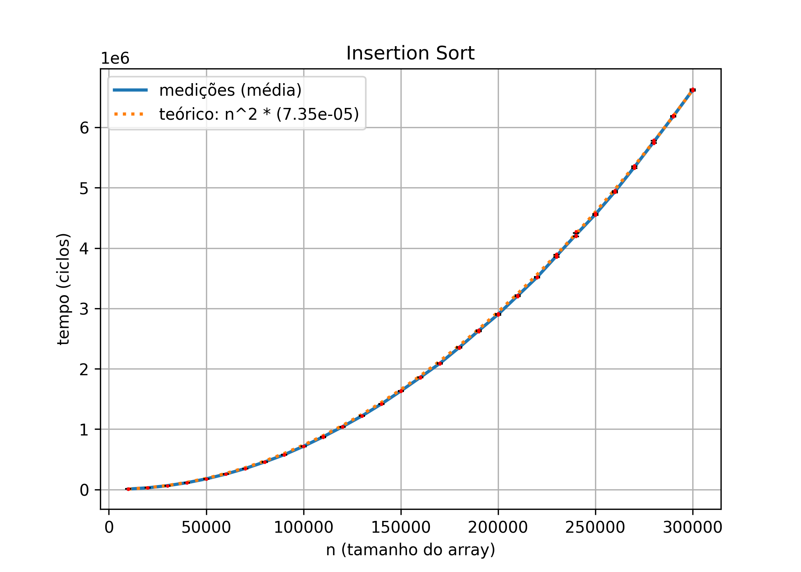
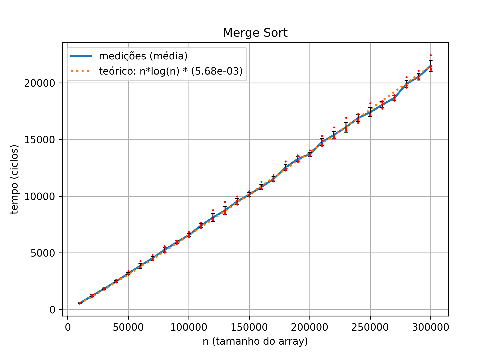
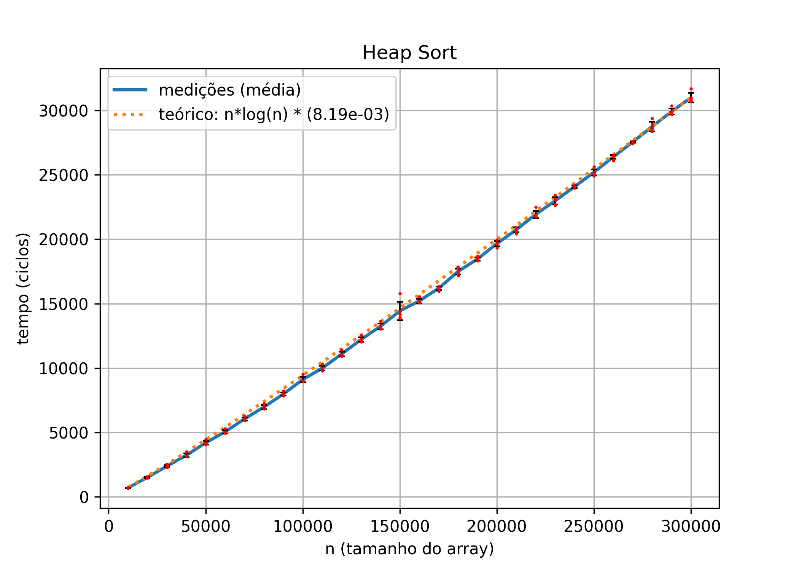
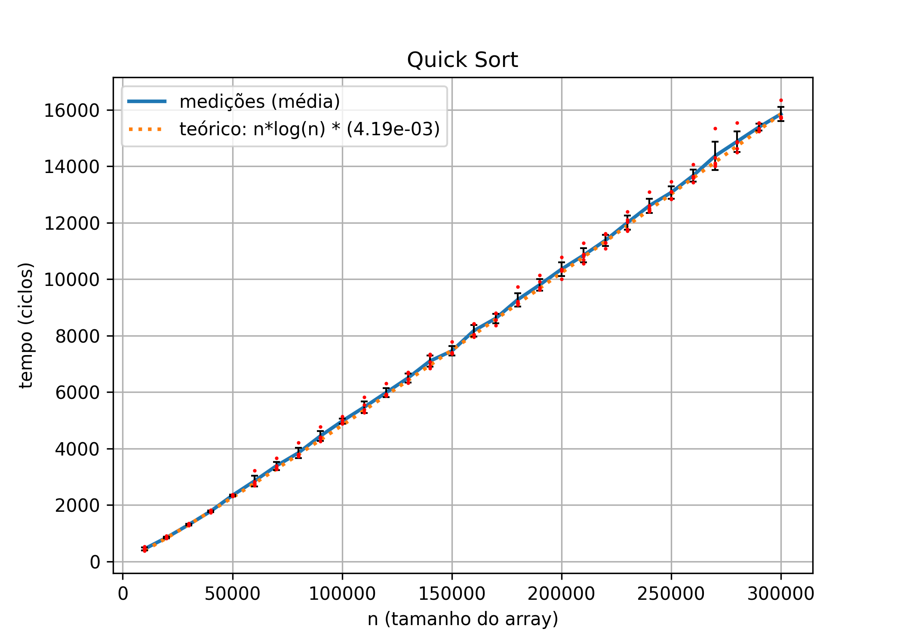
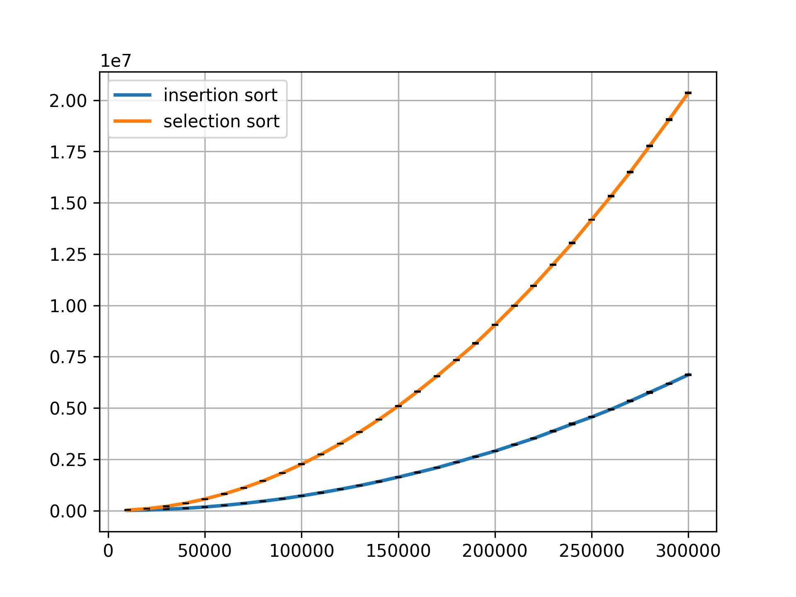

# sortperf

Empirical complexity analyisis of sorting algorithms

## Definition

This project aims to demonstrate the time complexity of sorting algorithms.

To maintain fairness, the following measures were taken:

- All algorithms, as well as the timing code, were implemented in C;
- The unit of measurement is clock cycles, as reported by `clock()` (time.h) immediately before and after the sorting function is called;
- After each timing test, we check if the array is actually sorted. If not, the entire run is invalidated;
- For each length `n`, we:
  - generate `t` arrays and fill them with `n` random integers between 0-`n`, we do not try to avoid duplicates;
  - run timing tests for each sorting algorithm using each of the `t` arrays;
  - take the average between the `t` measurements for each (algorithm, `n`) result set.
- When plotting results, we also plot the theoretical complexity as a dotted line, fitted to match the results for the highest value of `n`. (`plot_t = measured[-1] / theoretical[-1]`)

## Results

### Individual algorithms

### Algorithms comparison

